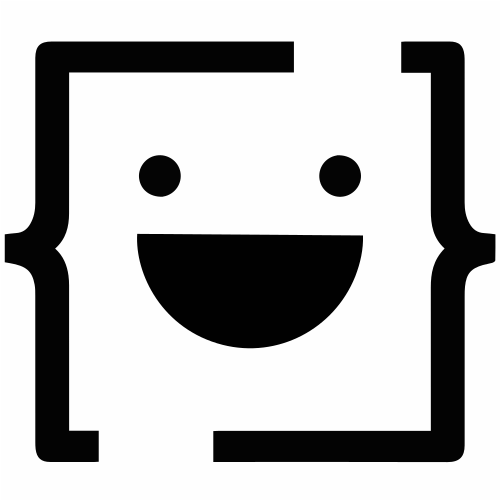

  

<h1 align="center">CoderBoyClub</h1>

  Build for developers.

  
  

## What is CoderBoyClub?

Coder Boy Club is a developer-focused platform designed to help developers learn, build, and improve their skills through practical resources and useful tools.

### Features

- Developer-focused learning resources
- Practical coding guidance
- Tools and resources for developers
- Continuous improvements and new features
- Community-driven feedback and suggestions

## Get Started

Ready to start learning?

Visit the **[CoderBoyClub](#)**  website and start exploring.

## Issues

Track bugs, feature requests, questions, and feedback here.

If you find a problem or have something you'd like to suggest, choose the option that best matches your request:

* 🐛 [Report a Bug](https://github.com/coderboyclub/issues/issues/new?template=bug_report.yml)
* ✨ [Request a Feature](https://github.com/coderboyclub/issues/issues/new?template=feature_request.yml)
* 💬 [Question & Feedback](https://github.com/coderboyclub/issues/issues/new?template=question_feedback.yml)

Your feedback helps us identify problems, improve existing features, and build a better experience for developers.

---

© CoderBoyClub
